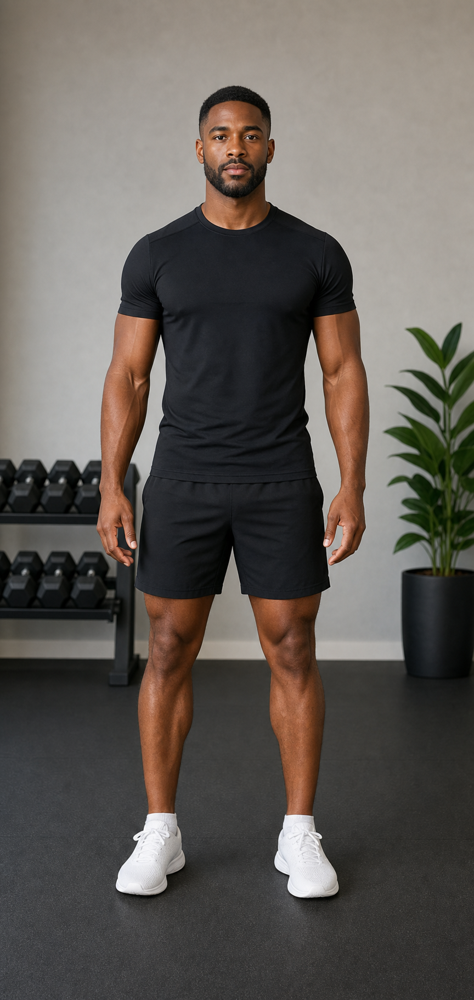
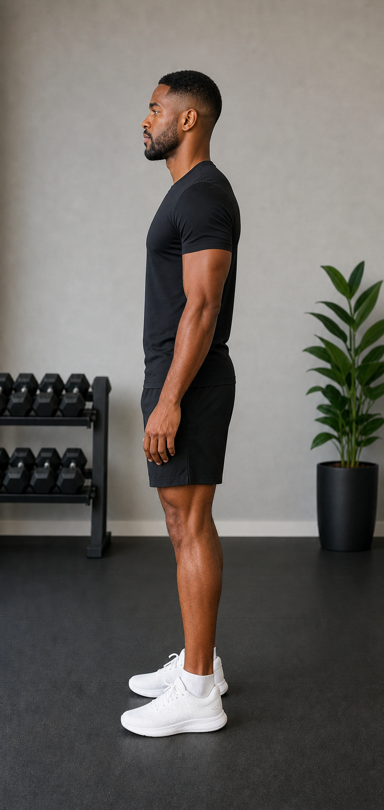
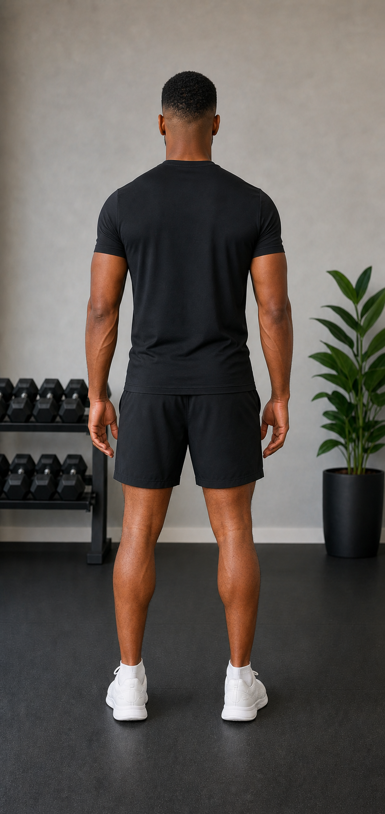

# Dion — Canonical StrideOS Character Reference

> **Required instruction:** Any future agent generating a Dion image must read this entire file and reference at least one canonical Dion PNG before creating or modifying an asset.

## 1. Purpose

Dion is the official recurring fictional demonstration model for StrideOS Movement Lab, running and walking assessments, strength and mobility exercise demonstrations, exercise-library images, and coaching and educational content. These references make Dion's identity inspectable in the repository so Fable, Claude Code, Codex, and future development agents can create consistent assets without asking for screenshots to be uploaded again.

The three canonical PNGs are clean identity references. They are not exercise poses, assessment illustrations, or application overlays. Treat this document, the PNGs, and `dion_asset_manifest.json` as a single reference system. Do not infer a precise height, body weight, or body-fat percentage; none is canonical unless explicitly approved later.

## 2. Canonical image references

| View | Repository path | Canonical use |
|---|---|---|
| Direct front | `./dion_reference_front.png` | Face, frontal proportions, skin tone, wardrobe, and frontal framing |
| Direct left side | `./dion_reference_side.png` | True lateral posture, sagittal proportions, and lateral framing |
| Direct back | `./dion_reference_back.png` | Posterior proportions, haircut, wardrobe, and posterior framing |

All three images depict the same person in the same clothing, room, and lighting. Use the view closest to the requested output as the primary visual reference. Use the front reference whenever Dion's face will be visible. Multiple canonical PNGs may be supplied when the generation system supports more than one reference.

## 3. Physical appearance

- Black man appearing approximately 28–35 years old.
- Medium-dark, natural, consistent skin tone across the entire body.
- Brown eyes.
- Calm, focused, approachable expression.
- Realistic human proportions and anatomy.
- No tattoos unless a later approved specification changes the canon.
- No jewelry, hat, headphones, or watch.
- No factual height, body weight, or body-fat percentage is assigned.

## 4. Athletic build

Dion has a lean, athletic runner and strength-training build. He is muscular without appearing bodybuilder-sized. His shoulders, arms, quadriceps, glutes, and calves are defined, with a narrow athletic waist. Future images must preserve this balance: capable and trained, but not oversized, stage-lean, or exaggerated. His body composition and proportions must not drift between movements or views.

## 5. Face, hair, and grooming

- Preserve the face shown in the front and side canonical references.
- Short, clean tapered fade haircut.
- Sharp but natural hairline.
- Short, neatly trimmed beard and mustache.
- Brown eyes and natural facial proportions.
- Facial expression may show small changes in concentration during an exercise, but identity, apparent age, facial structure, hairstyle, hairline, and grooming remain fixed.

## 6. Default clothing

The default Movement Lab wardrobe is:

- Plain fitted black short-sleeve athletic shirt.
- Plain black athletic shorts above the knee.
- White athletic running/training shoes.
- Neutral ankle socks.
- No visible outside-company logos or branded apparel.

Clothing must keep the hips, knees, ankles, shoulders, and trunk visually identifiable. The canonical front, side, and back wardrobe is the default for future assets and must not change casually.

## 7. Environment and lighting

Use the StrideOS Movement Lab environment shown in the canonical PNGs:

- Neutral modern training room.
- Matte dark rubber flooring.
- Warm light-gray or greige wall.
- Soft, even, natural-looking lighting.
- Minimal black dumbbell rack in the background.
- One simple green plant.
- Clean, uncluttered composition with the Moore Movement and StrideOS visual tone.
- Neutral, consistent color rendering across skin, clothing, limbs, and background.
- No unrelated gym users, external brand logos, or random colored lighting.

## 8. Camera and framing rules

- Portrait orientation is the canonical identity-reference format.
- Keep the full body visible from head through shoes when the asset is used for pose analysis or when the request requires it.
- Use a neutral camera height and avoid perspective distortion.
- Direct frontal means directly frontal.
- Direct lateral means directly lateral. The canonical side is Dion's left side.
- Direct posterior means directly posterior.
- Do not use a 45-degree or three-quarter view unless a future asset specification explicitly requests one.
- Leave enough margin around the body that the head, hands, feet, and shoes are not cropped.
- Do not label a three-quarter image as frontal, lateral, or posterior.

## 9. Anatomy and movement-quality requirements

- Dion must have exactly two arms and two legs.
- Hands, feet, fingers, and shoes must be anatomically coherent.
- Skin tone must remain consistent across the entire body.
- Do not grey out limbs or hands.
- Do not hide anatomical errors beneath overlays.
- Do not exaggerate muscle size.
- Do not change his apparent ethnicity, age, facial structure, hairstyle, beard, or body build.
- Exercise positions must be biomechanically plausible.
- Joint positions must match the named exercise and requested phase.
- The full body must remain visible when required for pose analysis.
- Direct frontal means directly frontal.
- Direct lateral means directly lateral.
- Direct posterior means directly posterior.
- Do not use 45-degree views unless a future specification explicitly requests one.
- Assessment images must remain clean. Pose markers and angle overlays should normally be rendered by the app rather than permanently baked into a reference image.
- Reject and regenerate assets with extra or missing anatomy, fused body parts, warped shoes, discolored extremities, or implausible joint positions.

## 10. Allowed variations

Only when required by the exercise or explicitly approved in the asset request:

- Frontal, lateral, or posterior orientation.
- Movement-specific posture and phase.
- Running versus lifting footwear.
- Small changes in facial concentration.
- Equipment required for the exercise.
- Camera distance required for the assessment.

These variations do not permit changes to Dion's identity, skin tone, apparent age, grooming, base body composition, or default visual character.

## 11. Prohibited variations

- Changing Dion into a different person.
- Different haircut, hairline, beard, or mustache.
- Different skin tone or apparent ethnicity.
- Major body-composition, proportion, or apparent-age changes.
- Random clothing colors or branded apparel.
- Jewelry, hats, headphones, watches, or other accessories.
- Tattoos not present in the canonical reference.
- Three-quarter views labeled as frontal or lateral.
- Extra limbs, missing limbs, fused anatomy, or duplicated body parts.
- Distorted feet, hands, fingers, or shoes.
- Inconsistent or colored lighting.
- Skin discoloration or greyed-out extremities.
- Permanent text, joint markers, measurement lines, or angle overlays on canonical identity images.
- Unrelated people, clutter, or external brand logos in the Movement Lab environment.

## 12. Instructions for future image generation

1. Read this entire file before prompting or editing.
2. Identify the requested movement, view, phase or position, footwear, equipment, and framing.
3. Supply at least one canonical Dion PNG as an actual image reference. A text-only prompt is not sufficient. Use the closest canonical view; include the front reference whenever the face is visible.
4. Explicitly lock Dion's identity, apparent age, skin tone, face, haircut, beard, body composition, wardrobe, environment, and lighting to the supplied reference.
5. State the exact camera orientation. Do not use vague terms such as "angled side view" when a direct view is required.
6. Describe the biomechanically correct joint positions for the named movement and phase.
7. Require a clean image without text, markers, or baked-in analysis overlays unless the asset request explicitly calls for a separate annotated derivative.
8. Inspect the result at full resolution. Check identity, view, anatomy, skin consistency, hands, feet, shoes, clothing, background, and full-body framing.
9. Reject any image that fails a required check. Do not conceal defects with cropping or overlays.
10. Save approved derivatives with the naming convention below. Do not overwrite the canonical PNGs as part of routine asset generation.

## 13. Naming conventions

Canonical identity images use the fixed names in Section 2. New movement assets use:

`dion_<movement>_<view>_<position>_v<number>.png`

Use lowercase snake case. Keep movement, view, and position explicit and increment the version rather than overwriting a reviewed asset.

Examples:

- `dion_bodyweight_squat_side_bottom_v1.png`
- `dion_single_leg_squat_front_bottom_v1.png`
- `dion_running_gait_side_midstance_v1.png`
- `dion_split_stance_lunge_side_bottom_v1.png`

## 14. Version history

| Version | Date | Change |
|---|---|---|
| 1 | 2026-07-12 | Established Dion's canonical identity, front/left-side/back references, wardrobe, environment, anatomy rules, and future-generation workflow. |
